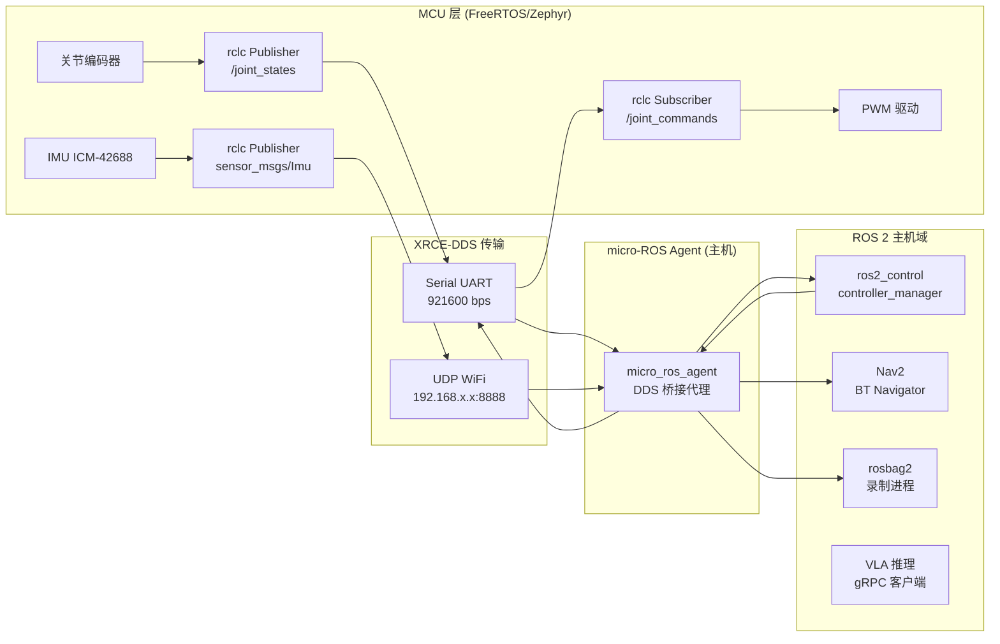

# micro-ROS 与分布式部署 — 总索引

> **调研范围**：micro-ROS 在具身智能分布式部署中的全栈技术图谱——从 MCU 端固件（FreeRTOS/Zephyr）到 Micro XRCE-DDS 传输层、micro-ROS Agent、主机端 ros2_control / Nav2 / VLA 推理层的完整分布式架构
>
> **关联文档**：
> - `docs/ros2-ecosystem/ros2_control_research/`（Phase 1，SystemInterface 硬件抽象）
> - `docs/ros2-ecosystem/realtime_research/`（Phase 7，RT 内核、CPU 隔离）
> - `docs/ros2-ecosystem/rosbag2_research/`（Phase 6，topic 录制）
> - `chassis_protocol/`（RS485 自定义帧协议，迁移评估对象）

---

## 一、micro-ROS 在具身智能分布式部署中的定位

在现代具身智能机器人系统中，**计算异构性**是不可回避的工程现实：
- **MCU 端**（Cortex-M / Xtensa / RISC-V）：负责关节驱动 PWM、编码器读取、IMU 采样、力矩传感器 ADC 等**硬实时、低延迟**任务；运行 FreeRTOS / Zephyr，RAM 通常 ≤ 512 KB
- **主机端**（Jetson Orin / x86 工控机）：负责 ros2_control 控制环、Nav2 导航、VLA 推理等**高算力、标准化**任务；运行 Linux + ROS 2 Humble/Jazzy

micro-ROS 正是连接这两端的**标准化桥梁**：它将 ROS 2 的核心通信模型（Publisher/Subscriber/Service/Timer）移植到资源受限 MCU，通过 **Micro XRCE-DDS** 协议与主机端 DDS 域互通。

### 典型部署场景

| 场景 | MCU 端角色 | 主机端角色 |
|------|-----------|-----------|
| 关节驱动器 | 编码器读取 → publish `/joint_states`；subscribe `/joint_commands` → PWM | ros2_control SystemInterface；JointTrajectoryController |
| IMU 节点 | 200 Hz 采样 → publish `sensor_msgs/Imu` | robot_localization EKF；Nav2 定位 |
| 力矩传感器 | 1 kHz ADC → publish `geometry_msgs/WrenchStamped` | MoveIt Servo 力控；阻抗控制器 |
| 电池管理 | 电压/电流 → publish `sensor_msgs/BatteryState` | 监控告警；Fleet Manager |
| E-Stop 安全链 | 硬件中断 → publish `/emergency_stop` | Safety Controller；lifecycle 节点终止 |

---

## 二、完整分布式架构图

### 2.1 纵向软件栈视图

```
┌─────────────────────────────────────────────────────────────────────────────────┐
│                    具身智能分布式架构（micro-ROS 方案）                              │
│                                                                                 │
│  ┌───────────────────────────────────────────────────────────────────────────┐ │
│  │  云 / 边缘推理层（可选）                                                     │ │
│  │  VLA 策略模型（OpenVLA / π0） ←→ gRPC/rosbridge → /vla_actions            │ │
│  └───────────────────────────────────────────────────────────────────────────┘ │
│                    ↕ ROS 2 Topic / Action（网络 DDS）                            │
│  ┌───────────────────────────────────────────────────────────────────────────┐ │
│  │  主机控制层（Jetson Orin / x86，Linux + ROS 2 Humble）                      │ │
│  │  ├─ controller_manager（1 kHz）                                           │ │
│  │  │    └─ SystemInterface::read()/write() → RealtimeBuffer                │ │
│  │  ├─ Nav2（BT Navigator + AMCL + Costmap2D）                              │ │
│  │  ├─ MoveIt 2（OMPL + Servo 实时增量控制）                                 │ │
│  │  ├─ rosbag2 录制进程（透明录制 MCU 端 topics）                             │ │
│  │  └─ Foxglove Studio 可视化                                               │ │
│  └───────────────────────────────────────────────────────────────────────────┘ │
│                    ↕ DDS Domain（CycloneDDS / FastDDS）                          │
│  ┌───────────────────────────────────────────────────────────────────────────┐ │
│  │  micro-ROS Agent 层（主机进程，非 RT 核）                                   │ │
│  │  micro_ros_agent --serial /dev/ttyUSB0 --baudrate 921600                 │ │
│  │  ├─ 多路 XRCE Session 复用（每个 MCU 一个 session_id）                    │ │
│  │  ├─ ProxyClient → DDS DataWriter/DataReader                              │ │
│  │  └─ 断线重连、会话超时管理                                                  │ │
│  └───────────────────────────────────────────────────────────────────────────┘ │
│                    ↕ Micro XRCE-DDS 传输层                                       │
│  ┌──────────────────────────┐   ┌──────────────────────────┐                  │
│  │  Serial/UART（RS485/TTL） │   │  UDP over WiFi/Ethernet  │                  │
│  │  波特率 921600 bps         │   │  ESP32 / W5500           │                  │
│  └──────────────────────────┘   └──────────────────────────┘                  │
│                    ↕ 物理总线                                                    │
│  ┌───────────────────────────────────────────────────────────────────────────┐ │
│  │  MCU 层                                                                   │ │
│  │  ┌─────────────────────┐  ┌─────────────────────┐  ┌───────────────────┐ │ │
│  │  │ STM32H7 关节驱动    │  │ ESP32-S3 IMU 节点   │  │ nRF5340 力矩传感  │ │ │
│  │  │ FreeRTOS            │  │ FreeRTOS + WiFi     │  │ Zephyr            │ │ │
│  │  │ rclc + XRCE-DDS     │  │ rclc + XRCE-DDS     │  │ rclc + XRCE-DDS   │ │ │
│  │  │ 编码器 / PWM        │  │ ICM-42688-P         │  │ ATI Nano17        │ │ │
│  │  └─────────────────────┘  └─────────────────────┘  └───────────────────┘ │ │
│  └───────────────────────────────────────────────────────────────────────────┘ │
└─────────────────────────────────────────────────────────────────────────────────┘
```

### 2.2 Mermaid 数据流图



---

## 三、延迟与资源预算表

### 3.1 典型 MCU 平台资源需求

| 硬件平台 | 主频 | Flash 需求 | RAM 需求 | 推荐 RTOS | 传输方式 | 适用场景 |
|---------|------|-----------|---------|----------|---------|---------|
| **ESP32-S3** | 240 MHz（双核 Xtensa LX7） | 1.5 MB | 320 KB | FreeRTOS（IDF 内置） | UDP/WiFi、Serial | IMU、电池、低速传感器 |
| **STM32F4** | 168 MHz（Cortex-M4） | 512 KB | 96 KB | FreeRTOS | Serial/UART | 入门级关节驱动 |
| **STM32H7** | 480 MHz（Cortex-M7） | 1 MB | 512 KB | FreeRTOS | Serial、USB CDC | 高性能关节驱动、4kHz 力控 |
| **Teensy 4.1** | 600 MHz（Cortex-M7） | 1 MB + 外部 QSPI | 1 MB | FreeRTOS / bare-metal | Serial、USB | 原型验证、Arduino 生态 |
| **Raspberry Pi Pico** | 133 MHz（双核 RP2040） | 2 MB | 264 KB | FreeRTOS | Serial/UART | 低成本传感器节点 |
| **nRF5340** | 128 MHz（Cortex-M33） | 1 MB | 512 KB | Zephyr | Serial、BLE（实验） | 无线分布式节点 |

> **最小资源需求**：micro-ROS 静态库约需 Flash 512 KB + RAM 32–64 KB（取决于实体数量和消息类型）

### 3.2 端到端延迟预算

| 传输方式 | 单次往返延迟（典型） | 最坏情况 | 抖动 | 适用场景 |
|---------|------------------|---------|------|---------|
| Serial 921600 bps | 1–3 ms | 5 ms | ± 0.5 ms | 关节控制（≤ 500 Hz） |
| USB CDC（Full Speed） | 0.5–2 ms | 4 ms | ± 0.3 ms | 关节控制（≤ 500 Hz） |
| UDP WiFi（ESP32） | 1–5 ms | 20 ms（重传） | ± 2 ms | 非关键传感器 |
| UDP 有线以太网（W5500） | 0.5–1.5 ms | 3 ms | ± 0.2 ms | 关节控制（≤ 500 Hz） |
| 定制 SPI Transport | 0.1–0.5 ms | 1 ms | ± 0.05 ms | 高频力控（需自研） |

> **关键约束**：ros2_control 1 kHz 控制环要求 hardware_interface read/write 总延迟 < 200 μs。Serial 传输在 > 500 Hz 时需使用 BEST_EFFORT QoS + DMA，否则建议降频至 200–500 Hz 或升级为 EtherCAT。

---

## 四、与本仓库 chassis_protocol 的关联速查

| chassis_protocol 组件 | micro-ROS 关联点 | 迁移影响 |
|----------------------|----------------|---------|
| `frame/frame_codec.cpp` | micro-ROS 使用 rosidl 生成的 C 结构体替代自定义帧格式 | 可完全替换，MCU 端无需自定义编解码 |
| `transport/rs485_transport.cpp` | micro-ROS Serial Transport 可直接复用 RS485 物理层 | 传输层复用，协议层替换 |
| `chassis/chassis_hal.cpp` | MCU 端移植到 rclc；主机端改为 `SystemInterface` 订阅/发布 | 较大改造 |
| `ros2_adapter/chassis_node.cpp` | 主机端适配层改为 micro-ROS `SystemInterface` | 中等改造 |
| `chassis/differential/differential_controller.cpp` | 里程计计算可留在 MCU 或迁移到主机 `DiffDriveController` | 灵活选择 |

详细迁移方案见 [07_integration.md](./07_integration.md)。

---

## 五、文档导航表

| 文件 | 内容摘要 |
|------|---------|
| [01_architecture.md](./01_architecture.md) | micro-ROS 软件栈分层、rclc vs rclcpp API 对比、XRCE-DDS 协议原理、Agent 桥接、支持 RTOS 与硬件资源对比表 |
| [02_transport_layer.md](./02_transport_layer.md) | Serial/UDP/USB CDC/Custom Transport 深度指南、分片处理、Discovery vs Static Agent、可靠性模式 |
| [03_rclc_programming.md](./03_rclc_programming.md) | rclc Executor、Timer、Service、参数服务器、Lifecycle、内存策略、完整 FreeRTOS 关节控制器伪代码 |
| [04_ros2_control_integration.md](./04_ros2_control_integration.md) | micro-ROS + ros2_control 分布式硬件接口架构、延迟分析、同步策略、EtherCAT 混合架构 |
| [05_distributed_deployment.md](./05_distributed_deployment.md) | DDS Domain 隔离、Agent 容器化部署、多机器人 namespace 规划、边缘-云协同、时间同步 |
| [06_firmware_build.md](./06_firmware_build.md) | micro_ros_setup 构建流程、自定义消息集成、OTA 固件更新、CI/CD、版本兼容性矩阵 |
| [07_integration.md](./07_integration.md) | chassis_protocol 迁移评估矩阵、Phase 7 RT 对接、Phase 6 数据录制、整体架构图、选型决策矩阵 |

---

## 六、技术选型速览

```
                MCU 节点数量 / 部署规模
                          ↓
          ┌───────────────────────────┐
          │   1–4 个 MCU 节点？        │
          └─────────────┬─────────────┘
                        │ 是                    否（> 4 节点 / 工厂自动化）
                        ↓                              ↓
          ┌─────────────────────────┐   ┌──────────────────────────────┐
          │  micro-ROS 推荐          │   │  EtherCAT（从站数量多时）     │
          │  FreeRTOS + rclc         │   │  或 micro-ROS + EtherCAT 混合│
          │  Serial/UDP 传输         │   │  EtherCAT 高速关节           │
          └─────────────────────────┘   │  micro-ROS 辅助传感器         │
                        │               └──────────────────────────────┘
                        ↓
          ┌─────────────────────────────────────────────┐
          │  延迟需求 < 1 ms（力控 / E-Stop）？           │
          └──────────────┬──────────────────────────────┘
                         │ 是                    否（关节控制 1–5 ms 可接受）
                         ↓                              ↓
          ┌──────────────────────────┐   ┌──────────────────────────────┐
          │  需要定制 SPI Transport   │   │  标准 Serial 921600 bps 足够  │
          │  或升级 EtherCAT 主站     │   │  BEST_EFFORT QoS             │
          └──────────────────────────┘   └──────────────────────────────┘
```
