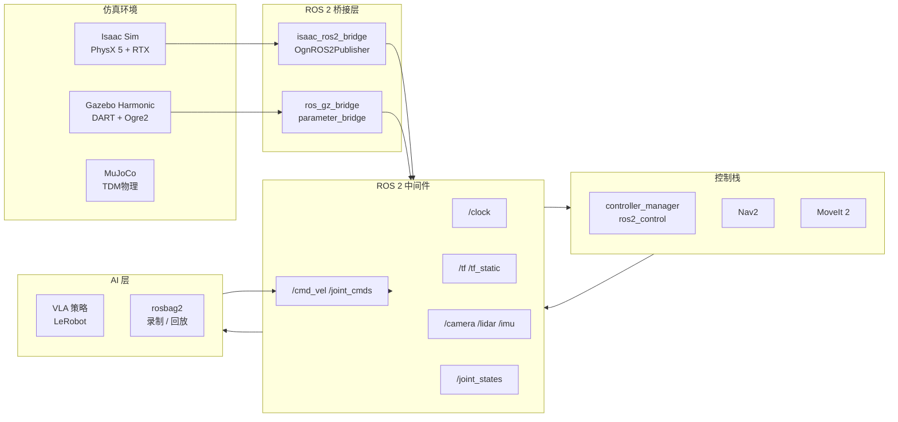

# 仿真栈（Isaac Sim / Gazebo Harmonic）— 总索引

> **调研范围**：面向具身智能机器人的完整仿真技术栈——从物理仿真引擎、GPU 渲染、传感器仿真，到 Sim-to-Real 迁移、训练数据生成，再与 ROS 2 / ros2_control / Nav2 / MoveIt 2 的深度集成  
> **关联文档**：
> - `docs/ros2-ecosystem/ros2_control_research/`（Phase 1，Hardware Interface 抽象）
> - `docs/embodied-ai/llm_vla_ros2_integration/`（Phase 3，VLA 训练数据飞轮）
> - `docs/ros2-ecosystem/rosbag2_research/`（Phase 6，数据录制格式）
> - `docs/ros2-ecosystem/realtime_research/`（Phase 7，RT 进程隔离）

---

## 一、具身智能仿真需求矩阵

具身智能仿真系统需在多个维度同时满足要求，不同场景对各维度的权重差异显著：

| 仿真需求维度 | 强化学习训练 | 功能测试 / CI | 传感器标定 | 演示数据生成 | Sim-to-Real 部署 |
|------------|-----------|-------------|----------|------------|----------------|
| **物理仿真精度** | ⭐⭐⭐⭐ | ⭐⭐⭐ | ⭐⭐ | ⭐⭐⭐ | ⭐⭐⭐⭐⭐ |
| **GPU 渲染质量** | ⭐⭐ | ⭐⭐ | ⭐⭐⭐⭐⭐ | ⭐⭐⭐⭐ | ⭐⭐⭐⭐ |
| **传感器仿真** | ⭐⭐⭐ | ⭐⭐⭐ | ⭐⭐⭐⭐⭐ | ⭐⭐⭐⭐ | ⭐⭐⭐⭐⭐ |
| **训练数据生成** | ⭐⭐⭐⭐⭐ | ⭐ | ⭐⭐ | ⭐⭐⭐⭐⭐ | ⭐⭐⭐ |
| **Sim-to-Real 迁移** | ⭐⭐⭐⭐⭐ | ⭐⭐ | ⭐⭐⭐ | ⭐⭐⭐⭐ | ⭐⭐⭐⭐⭐ |
| **ROS 2 集成深度** | ⭐⭐⭐ | ⭐⭐⭐⭐⭐ | ⭐⭐⭐⭐ | ⭐⭐⭐⭐ | ⭐⭐⭐⭐⭐ |
| **并行仿真规模** | ⭐⭐⭐⭐⭐ | ⭐ | ⭐ | ⭐⭐⭐ | ⭐⭐ |
| **开源/授权成本** | ⭐⭐⭐ | ⭐⭐⭐⭐⭐ | ⭐⭐⭐⭐⭐ | ⭐⭐⭐ | ⭐⭐⭐ |
| **ARM64 / Jetson 支持** | ⭐⭐ | ⭐⭐⭐⭐ | ⭐⭐⭐ | ⭐⭐ | ⭐⭐⭐⭐⭐ |

> ⭐⭐⭐⭐⭐ = 关键需求 / ⭐ = 可选或不相关

---

## 二、完整仿真栈架构图

### 2.1 纵向分层架构

```
┌─────────────────────────────────────────────────────────────────────────────┐
│                          具身智能完整仿真栈                                     │
│                                                                             │
│  ┌───────────────────────────┐  ┌───────────────────────────────────────┐  │
│  │   NVIDIA Isaac Sim        │  │   Gazebo Harmonic (gz-sim 8.x)        │  │
│  │   (Omniverse USD)         │  │   (gz-transport + SDF)                │  │
│  │                           │  │                                       │  │
│  │  PhysX 5 物理引擎          │  │  DART / Bullet / TPE 物理引擎          │  │
│  │  RTX 光线追踪渲染           │  │  Ogre2 / gz-rendering 8              │  │
│  │  omni.replicator          │  │  gz-sensors 8                         │  │
│  │  Isaac Lab (GPU 并行)      │  │  Python bindings                      │  │
│  └───────────────────────────┘  └───────────────────────────────────────┘  │
│         │  OmniGraph / ROS2 Bridge              │  ros_gz_bridge          │  │
│         ▼                                       ▼                          │  │
│  ┌─────────────────────────────────────────────────────────────────────┐   │
│  │                    ROS 2 Humble / Jazzy 层                           │   │
│  │                                                                     │   │
│  │  /clock  /tf  /tf_static  /joint_states  /cmd_vel                   │   │
│  │  /camera/image_raw  /scan  /imu/data  /odom                         │   │
│  │                                                                     │   │
│  │  ┌──────────────────┐  ┌─────────────┐  ┌──────────────────────┐   │   │
│  │  │ ros2_control     │  │   Nav2      │  │  MoveIt 2            │   │   │
│  │  │ controller_mgr   │  │  BT Nav     │  │  move_group          │   │   │
│  │  │ JTC / DiffDrive  │  │  costmap2d  │  │  MoveIt Servo        │   │   │
│  │  └──────────────────┘  └─────────────┘  └──────────────────────┘   │   │
│  └─────────────────────────────────────────────────────────────────────┘   │
│         │                                                                   │
│         ▼                                                                   │
│  ┌─────────────────────────────────────────────────────────────────────┐   │
│  │        chassis_protocol HAL / 实机 Hardware Interface                 │   │
│  │  (仿真中替换为 GazeboSystem / IsaacSystem，接口统一)                    │   │
│  └─────────────────────────────────────────────────────────────────────┘   │
└─────────────────────────────────────────────────────────────────────────────┘
```

### 2.2 数据流向图（Mermaid）



---

## 三、三大仿真器横向对比总表

| 对比维度 | **Isaac Sim 4.x** | **Gazebo Harmonic** | **MuJoCo 3.x** |
|---------|-------------------|---------------------|----------------|
| **物理引擎** | NVIDIA PhysX 5（GPU 加速刚体 + 关节） | DART 6 / Bullet 3 / TPE（CPU） | MuJoCo TDM（高精度接触，CPU） |
| **物理精度（接触）** | ⭐⭐⭐⭐ | ⭐⭐⭐ | ⭐⭐⭐⭐⭐ |
| **关节仿真** | PhysX Articulation（Featherstone） | DART Recursive（精确） | Generalized Coordinate（最精确） |
| **渲染引擎** | NVIDIA RTX 光线追踪 / Vulkan | Ogre2（光栅化）/ gz-rendering 8 | 无光追；内置 OpenGL 可视化 |
| **渲染质量** | ⭐⭐⭐⭐⭐（PBR + GI + 焦散） | ⭐⭐⭐ | ⭐⭐（基础） |
| **GPU 并行仿真** | ✅ Isaac Lab：1024+ 并行环境 | ❌（进程级并行） | ✅ MJX（JAX GPU）：有限 |
| **ROS 2 集成** | ✅ 官方 isaac_ros2_bridge；OmniGraph 节点 | ✅ ros_gz_bridge；gz_ros2_control 官方支持 | ⚠️ 需 mujoco_ros2 第三方包 |
| **ros2_control 支持** | ✅ isaac_ros2_control_plugin | ✅ gz_ros2_control (官方) | ⚠️ 社区维护 |
| **传感器仿真** | RTX Lidar / 深度相机 / IMU / 力矩（光追精度） | Camera / DepthCam / GPU Lidar / IMU / FT | 有限（MjCamera / MjSensor） |
| **Domain Randomization** | ✅ omni.replicator（成熟 API） | ⚠️ 部分支持（世界 SDF 脚本） | ⚠️ MJX 可做，API 较低级 |
| **RL 训练框架** | Isaac Lab（前 OmniIsaacGymEnvs）；与 RL Games / RSL-RL 集成 | gym_gz / 部分支持 | gymnasium（标准接口）；dm_control |
| **Sim-to-Real 工具链** | ✅ nvblox 重建；USD 数字孪生；系统辨识 | ✅ SDFormat；较成熟生态 | ⚠️ 需手动系统辨识 |
| **世界描述格式** | Omniverse USD | SDF 1.11 / SDFormat | MJCF XML |
| **Python API 完整度** | ✅ omni.isaac.core；完整 Python 扩展体系 | ✅ gz.sim Python bindings（8.x 新增） | ✅ mujoco Python（dm_control） |
| **ARM64 / Jetson 支持** | ⚠️ x86 + RTX 为主；Jetson 有限预览 | ✅ ARM64 官方支持（Harmonic 新增） | ✅ 跨平台 |
| **授权** | 企业授权（教育/研究免费；OV Pro 收费） | Apache 2.0（完全开源） | Apache 2.0（2.x 起开源） |
| **最低硬件** | RTX GPU 必需（RTX 3080+ 推荐） | CPU 即可（GPU 加速可选） | CPU 即可（MJX 需 GPU） |
| **社区 / 生态** | NVIDIA 官方驱动，生态增长快 | 最大 ROS 社区生态 | 学术研究首选，社区活跃 |

> **选型速查**：RL 训练 → Isaac Sim（Isaac Lab GPU 并行）；ROS 2 功能测试 / CI → Gazebo Harmonic；高精度接触力仿真（手部操作）→ MuJoCo；ARM64 / 低成本部署 → Gazebo Harmonic。

---

## 四、与本仓库关联速查

| 本仓库组件 | 仿真关联点 | 相关文档 |
|-----------|-----------|---------|
| `chassis_protocol/chassis/chassis_hal.cpp` | `ChassisHal` 需提供 Mock / Sim 版本，供 `GazeboSystem` / `IsaacSystem` 在仿真中替代实机通信 | `07_integration.md §1` |
| `chassis_protocol/transport/rs485_transport.cpp` | 仿真模式下 Transport 替换为空实现（NullTransport），驱动命令直接发送到仿真关节 | `04_ros2_control_sim.md §1` |
| Phase 6 `rosbag2_research` | Isaac Sim ROS 2 Bridge → `ros2 bag record` 录制演示数据；MCAP 格式存储；`use_sim_time: true` | `06_training_data_generation.md` |
| Phase 3 `llm_vla_ros2_integration` | 仿真演示数据 → LeRobot HDF5 → VLA 训练完整闭环；Policy rollout 验证 | `03_sim_to_real.md §3` |
| Phase 7 `realtime_research` | 仿真进程独占非 RT 核，不干扰 RT 控制进程（`isolcpus` 隔离） | `07_integration.md §3` |

---

## 五、文档导航表

| 文件 | 内容摘要 |
|------|---------|
| [00_index.md](./00_index.md) | 本文档：需求矩阵、整体架构图、三器对比总表、关联速查 |
| [01_isaac_sim_architecture.md](./01_isaac_sim_architecture.md) | Isaac Sim 架构深度：USD / PhysX 5 / RTX、ROS 2 集成、OmniGraph、传感器、Domain Randomization、Isaac Lab |
| [02_gazebo_harmonic.md](./02_gazebo_harmonic.md) | Gazebo Harmonic 深度：ECS 架构、gz-transport、ros_gz_bridge、gz_ros2_control、物理引擎对比、新特性 |
| [03_sim_to_real.md](./03_sim_to_real.md) | Sim-to-Real 迁移：Domain Gap 分析、DR 策略、Reality Gap 度量、VLA 数据飞轮、系统辨识、测试 checklist |
| [04_ros2_control_sim.md](./04_ros2_control_sim.md) | 仿真中 ros2_control：Isaac / Gazebo 集成、统一 URDF/xacro、仿真时钟对齐、MoveIt 2 集成 |
| [05_sensor_simulation.md](./05_sensor_simulation.md) | 传感器仿真精度：RGB / 深度 / LiDAR / IMU / 力矩、噪声模型、同步、渲染性能权衡 |
| [06_training_data_generation.md](./06_training_data_generation.md) | 训练数据生成：omni.replicator 流水线、rosbag2 录制、并行 rollout、数据质量评估、混合数据集 |
| [07_integration.md](./07_integration.md) | 与本仓库对接：chassis_protocol 仿真 HAL、VLA 数据飞轮、RT 核隔离、数字孪生更新、选型决策矩阵 |

---

## 六、仿真工具链版本矩阵

| 工具 | 当前稳定版 | ROS 2 Humble 支持 | ROS 2 Jazzy 支持 | 备注 |
|------|----------|------------------|-----------------|------|
| Isaac Sim | 4.2.0 (2024) | ✅ | ✅ | 需 NVIDIA GPU Driver ≥ 535 |
| Isaac Lab | 1.2.0 | ✅（Python 3.10） | ✅ | 基于 Isaac Sim 4.x |
| Gazebo Harmonic | 8.x (LTS) | ✅（ros_gz_sim） | ✅（默认配对） | LTS 到 2028 |
| ros_gz_bridge | 2.0.x（Humble）/ 3.x（Jazzy） | ✅ | ✅ | `parameter_bridge` 节点 |
| gz_ros2_control | 1.x | ✅ | ✅ | 前身 `ign_ros2_control` |
| MuJoCo | 3.1.x | ⚠️ 第三方 | ⚠️ 第三方 | 官方无 ROS 2 bridge |
| mujoco_ros2 | 0.x (社区) | ⚠️ | ⚠️ | 功能不完整 |
